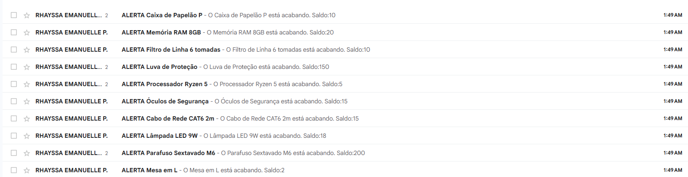

# 📦 Automação de Análise de Estoque

Projeto de automação desenvolvido para monitoramento proativo de níveis de estoque, visando a redução de *Stockouts* (ruptura de estoque) e eliminação de conferências manuais.

## 📷 Visão Geral do Projeto

Aqui você pode ver o "bastidor" (o código) e o "palco" (o resultado final para o usuário).

| Lógica do Robô (Fluxo) | Resultado Final (E-mail) |
|:---:|:---:|
|  |  |
| *O robô analisa a planilha diariamente* | *O alerta chega automaticamente no e-mail* |

---

## 🛠 Tecnologias Utilizadas
* **Power Automate** (Cloud Flow, Lógica Condicional, Gatilhos Agendados)
* **Excel Online / OneDrive for Business** (Base de Dados em Nuvem)
* **Outlook 365** (Sistema de Notificação)

## 📋 Funcionalidades
* **⏰ Monitoramento Contínuo:** O robô "acorda" automaticamente todo dia em horário programado.
* **🧠 Decisão Lógica:** Analisa linha por linha da tabela `Estoque`. Se a `Qtd_Atual` for menor ou igual ao `Estoque_Minimo`, ele ativa o gatilho.
* **📧 Alerta Dinâmico:** Envia um e-mail personalizado contendo o Nome do Produto, Quantidade Restante e aviso de reposição imediata.

## 🚀 Como testar este projeto
1. Baixe o arquivo `Controle_Estoque.xlsx` disponível neste repositório.
2. Suba para o seu OneDrive for Business (conta institucional).
3. Importe a lógica no Power Automate e aponte para o arquivo no seu OneDrive.
